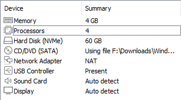
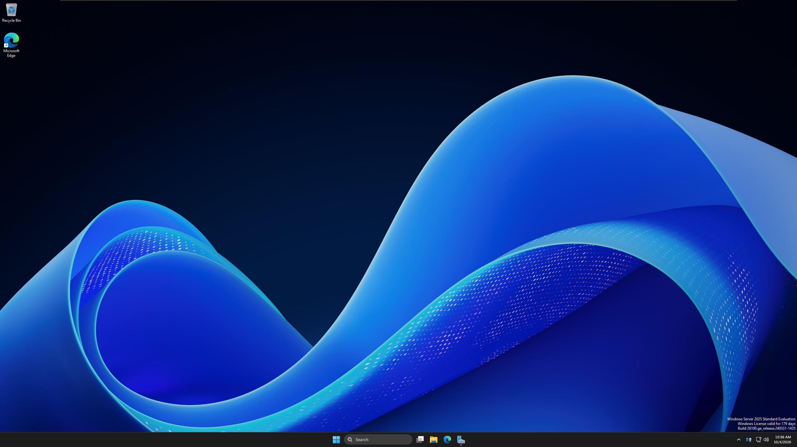
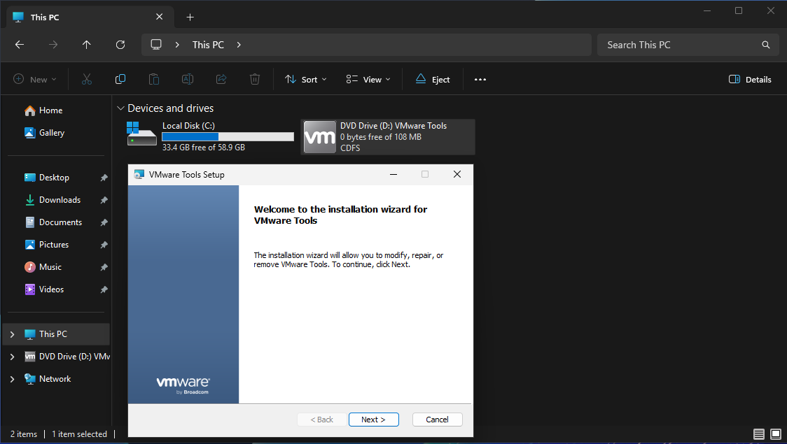
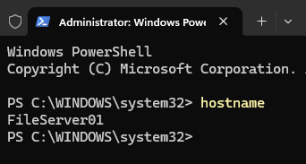
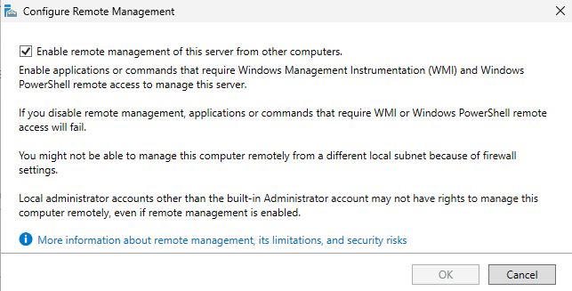
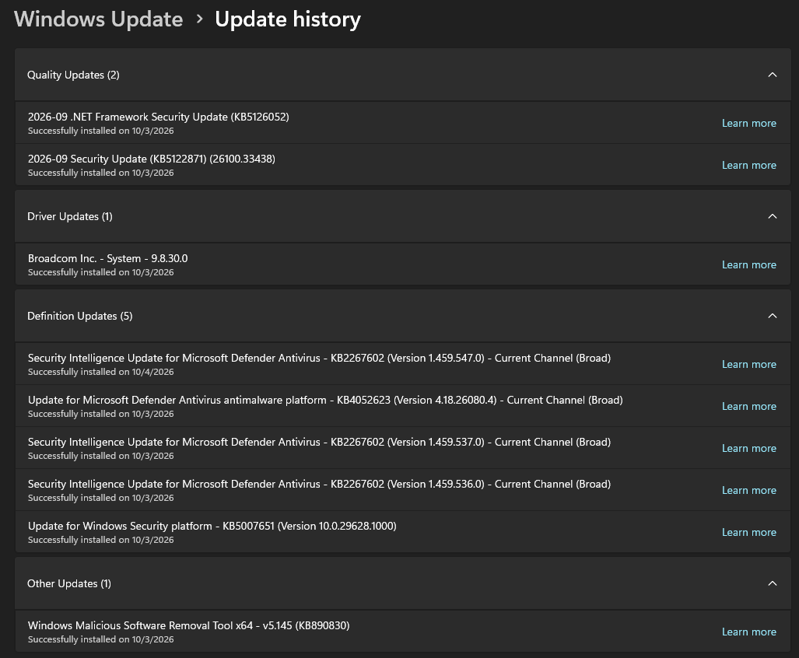

[← Back to Main README](../README.md)

# Windows Server 2025 VM Deployment

## Overview

This section documents the installation and initial configuration of a Windows Server 2025 virtual machine using VMware Workstation.

This server will serve as the foundation for the home lab and will be configured as a Domain Controller and File Server.

## Objectives

- Create a Windows Server 2025 virtual machine
- Configure the VM's hardware resources
- Install Windows Server 2025
- Install VMware Tools
- Configure the server hostname and timezone
- Enable Remote Management
- Install Windows Updates

---

## Prerequisites

- Meet the system requirements for VMware Workstation and Windows Server 2025
- Have VMware Workstation installed

---

## Lab Environment

| Component | Configuration |
|---|---|
| Hypervisor | VMware Workstation |
| Operating System | Windows Server 2025 |

---

## 1. Create the Virtual Machine

A new virtual machine was created in VMware Workstation.

### VM Configuration

- Operating system: `Windows Server 2025`
- Hostname: `Windows Server 2025`
- Number of processors: `2`
- Number of cores per processor: `2`
- Memory: `4 GB`
- Storage: `60 GB`
- Network: `NAT`

---

## 2. Install Windows Server 2025

The .iso was mounted to the virtual machine and the operating system installation was completed.

### Installation Steps

1. Booted the VM from the Windows Server 2025 installation file.
2. Selected `English`.
3. Selected `Install Windows Server`.
4. Selected the `Windows Server 2025 Standard (Desktop Experience)` installation option.
5. Accepted the Microsoft Software License Terms.
6. Selected the virtual disk (.iso) as the installation destination.
7. Completed the Windows installation.
8. Created the initial local administrator password.
9. Logged into Windows Server for the first time.

---

## 3. Initial Server Configuration

After installation, the server was configured with basic settings required for the home lab.

### VMware Tools Installation

- VM → Install VMware Tools
- Installed VMware Tools for better performance.

Ran the installation wizard from the (D:) drive:

### Hostname Configuration

- Run → `sysdm.cpl` → Computer Name → Change...
- Configured the hostname to `FileServer01`.

### Change Time Zone

- Settings → Time & language → Date & time
- Changed to correct time zone.

### Enable Remote Management

Server Manager → Local Server
Changed Remote management to `Enabled`.

### Install Windows Updates

- Settings → Windows Update
- Ran Windows Update to ensure system is stable and current.

---
