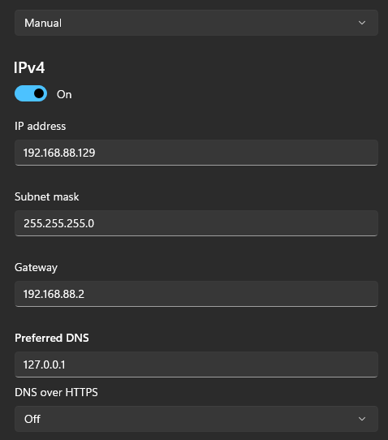
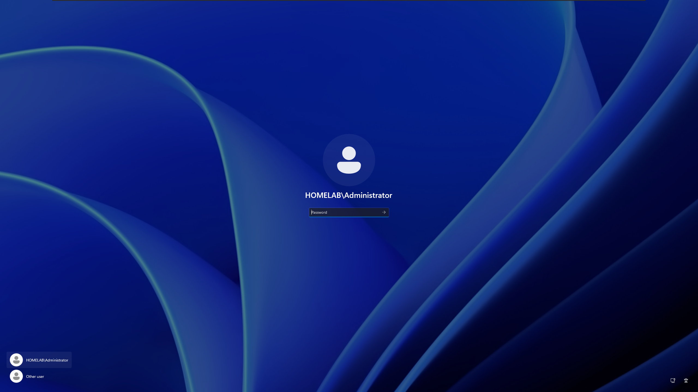
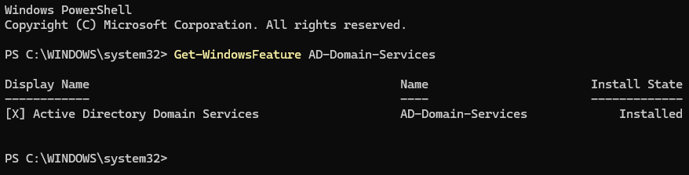
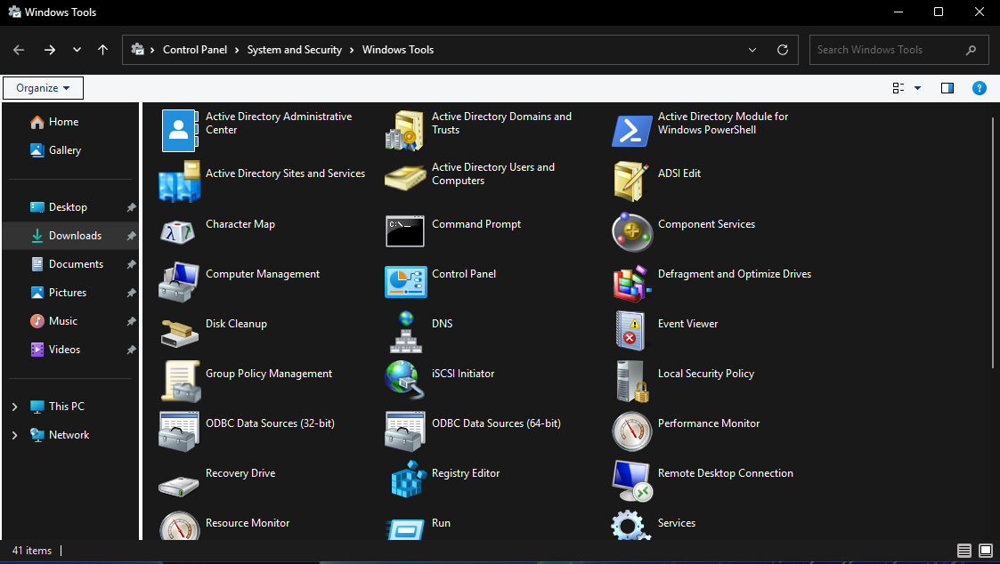

[← Back to Main README](../README.md)

# Active Directory Domain Services Configuration

## Overview

This section documents the installation and configuration of Active Directory Domain Services (AD DS).

The Windows Server 2025 virtual machine created during the previous section of the home lab will be configured as a Domain Controller.

Active Directory will provide centralized authentication and management of users, computers, and security groups within the lab environment.

## Objectives

- Configure the Windows Server 2025 server for Active Directory
- Configure the network settings as part of the Active Directory deployment
- Install the Active Directory Domain Services role
- Promote the server to a Domain Controller
- Create a new Active Directory forest and domain

---

## Prerequisites

- Administrative access to the Windows Server
- Server hostname configured
- Windows Server 2025 updated
- Network connectivity verified

---

## Lab Environment

| Component | Configuration |
|---|---|
| Hypervisor | VMware Workstation |
| Operating System | Windows Server 2025 |
| Edition | Standard |
| Installation Type | Desktop Experience |
| Server Name | FileServer01 |

---

## Configure Network Settings

Before installing Active Directory Domain Services, the Windows Server was configured with a static IP address.

The following settings were configured:

- IP Address
- Subnet Mask
- Default Gateway
- Preferred DNS

### Configuration Steps

1. Opened **Windows PowerShell** → Typed `ipconfig` → **Copied the IPv4 Address** automatically assigned by DHCP (`192.168.88.129`).
2. Opened **Settings → Network & internet → Ethernet**.
3. Clicked `Edit` for IP assignnemt.
4. Set configuration to `Manual` and pasted the IP address.
5. Configured the **subnet mask** to `255.255.255.0`
6. Configured the **default gateway** to `192.168.88.2`
7. Configured the **DNS** to the loopback address.
8. Saved the network configuration.



---

## Install Active Directory Domain Services

The Active Directory Domain Services (AD DS) role was installed using Server Manager.

### Configuration Steps

1. Opened **Server Manager**.
2. Selected **Manage** → **Add Roles and Features**.
3. Selected **Role-based or feature-based installation**.
4. Selected **FileServer01**.
5. Selected **Active Directory Domain Services** → **Add Features**.
6. Clicked **Next** → **Install**.
8. Waited for the installation to complete → Completed

---

## Promote the Server to a Domain Controller

After installing the Active Directory Domain Services role, the server was promoted to a Domain Controller.

### Configuration Steps

1. Selected **Promote this server to a domain controller**.
2. Selected **Add a new forest**.
3. Entered the root domain name: `homelab.local`
4. Confirmed that **Windows Server 2025** was selected.
5. Entered and confirmed the Directory Services Restore Mode (DSRM) password.
6. Left the DNS delegation options unselected.
7. Verified the NetBIOS domain as **HOMELAB**.
8. Kept the default AD DS database, log files, and SYSVOL folder locations.
9. Clicked **Install** after the prerequisite check completed successfully.
10. The server restarted automatically after the promotion completed.

### Verify Installation

The domain was displayed on the login screen upon reboot:



Verified using PowerShell:

```powershell
Get-WindowsFeature AD-Domain-Services
```


Control Panel → System and Security → Windows Tools

Confirmed successful installation of:

- Active Directory Users and Computers
- Group Policy Management
- Remote Desktop Connection




> To be continued:
> - Create Organizational Units
> - Create test user accounts
> - Create security groups
> - Configure group membership
> - Verify domain authentication

---
