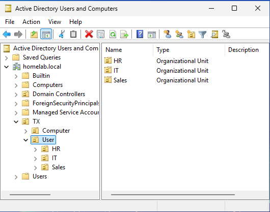
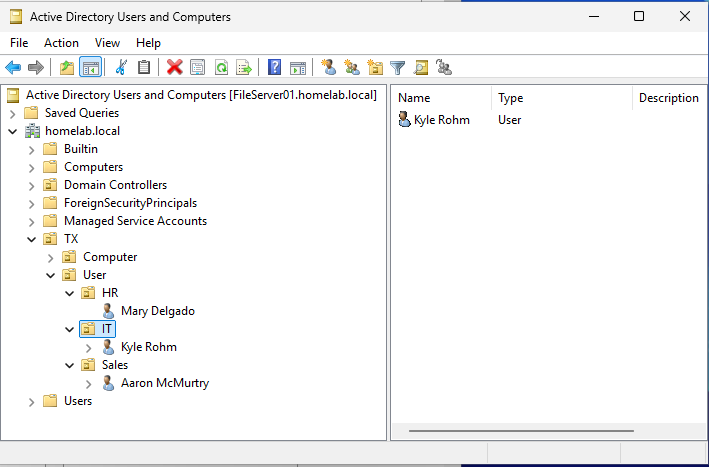
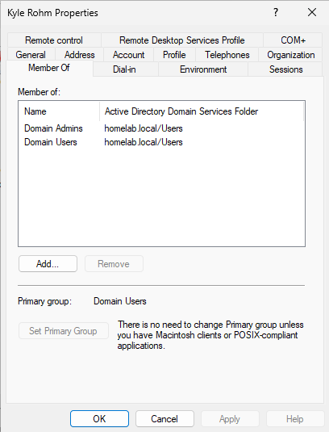
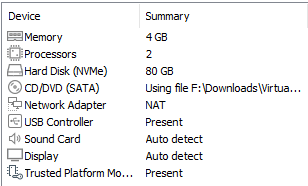

[← Back to Main README](../README.md)

# Active Directory Users and Windows 11 Client

## Overview

This section documents the creation of Organizational Units (OUs) and user accounts in the Active Directory environment.

A Windows 11 virtual machine was then deployed and configured as a domain-joined client.

## Objectives

- Create an Organizational Unit structure
- Add HR, IT, and Sales folders with user accounts
- Create and configure a Windows 11 client virtual machine
- Join the Windows 11 client to the Active Directory domain
- Verify network connectivity between the Windows 11 client and Domain Controller
- Follow best practices for domain-joined clients

---

## Prerequisites

- Windows Server 2025 configured as a Domain Controller
- Active Directory Domain Services installed
- IP and DNS settings configured
- DNS configured and operational
- Downloaded copy of Windows 11 Client installation media

---

## Lab Environment

| Component | Configuration |
|---|---|
| Hypervisor | VMware Workstation |
| Operating System | Windows Server 2025 |
| Domain Controller | FileServer01 |
| Active Directory Domain | homelab.local |
| DNS Server | 192.168.88.129 |

---

## Create Organizational Units

A corporate OU structure with departments was created to organize the users and computers within the lab environment.

### Configuration Steps

- Opened **Server Manager** → **Tools** → **Active Directory Users and Computers**.
- Right-clicked `homelab.local`.
- Selected **New** → **Organizational Unit**.
- Created Organizational Unit `TX`.
- Right-clicked the `TX` OU.
- Selected **New** → **Organizational Unit**.
- Created an OU named `HR`.
- Repeated the process to create `IT` and `Sales`.



---

## Create User Accounts

Created three user accounts and place each in the appropriate OU.

### Account Creation Steps

1. Opened **Server Manager**.
2. Selected **Tools → **Active Directory Users and Computers**.
4. Navigated to `TX → HR`.
5. Right-clicked `HR` and selected **New** → **User**.
6. Entered the user's information.
7. Configured a username and password.
8. Selected **Finish**.
9. Repeated the process to create user accounts in `IT` and `Sales`.



### Assign Domain Admin Group

Applied the **Domain Admins** security group to the IT user account.

1. Double-clicked `Kyle Rohm` and selected **New → User**.
2. Clicked **Member Of** → **Add**
3. Typed `Domain Admins` into the text field → **Check Names** → **OK**
4. Applied changes.



> This security group will be used later to join the Windows 11 client to the domain.

---

## VM Configuration

Create a Windows 11 virtual machine in VMware.

1. **VMware** → **Create a New Virtual Machine**
2. Went through the VM Wizard and entered a **TPM** password.
3. Set number of processors to **2** and cores per processor to **1**.
4. Memory: **4 GB** → Network Type: **NAT** → I/O controller: **LSI Logic SAS**
5. Virtual disk: **NVMe** → Selected **Create a new virtual disk** → Disk size: **80 GB**
6. Clicked **Customize Hardware** → **New CD/DVD (SATA)** and selected the saved Win 11 .iso.



---

## 2. Install Windows 11

Create a Windows 11 virtual machine to serve as the client computer for the Active Directory domain.

### Installation Steps

1. Powered on the configured Windows 11 VM.
2. Selected **English** → **Install Windows 11**.
3. Selected the **I don't have a product key** option.
4. Selected the **Windows 11 Pro** image.
> Note: Only *Windows 11 Pro* and *Windows 11 Enterprise* versions can be joined to an Active Directory domain.
5. Named the device: `Computer01`
6. **Setup for work or school** → **Sign-in options** → **Domain join instead**
7. Named the profile: `Kyle Rohm` → Setup a password and security questions.
8. Completed final installation steps, booted into Windows 11 and installed VMware Tools.


---

## Install VMware Tools

Install VMware Tools on the Windows 11 client to improve virtual machine integration and performance.

1. Start `Computer01`.
2. In VMware Workstation, select **VM → Install VMware Tools**.
3. Open the VMware Tools installer inside Windows 11.
4. Follow the installation wizard using the default options.
5. Restart `Computer01` when prompted.


---

## Run Windows Updates

Bring the Windows 11 client up to date before joining it to the Active Directory domain.

1. Open **Settings**.
2. Select **Windows Update**.
3. Select **Check for updates**.
4. Install all available updates.
5. Restart the computer when required.
6. Repeat the process until Windows Update reports that the system is up to date.


---

## Configure Manual DNS Settings

Configure the Windows 11 client to use `FileServer01` as its DNS server.

1. Open **Settings**.
2. Select **Network & internet**.
3. Select the active network connection.
4. Select **Edit** next to **DNS server assignment**.
5. Change the setting to **Manual**.
6. Enable **IPv4**.
7. Enter the IP address of `FileServer01` as the preferred DNS server.
8. Save the configuration.

Verify the DNS configuration using Command Prompt:

```powershell
ipconfig /all
````

Confirm that the DNS server listed for the Windows 11 client is the IP address of `FileServer01`.


---

## Test Network Connectivity

Verify that the Windows 11 client can communicate with the Domain Controller.

Open Command Prompt on `Computer01` and run:

```powershell
ping <FILESERVER01-IP-ADDRESS>
```

A successful response should resemble:

```text
Reply from <FILESERVER01-IP-ADDRESS>: bytes=32 time<1ms TTL=128
```

Successful replies confirm that the Windows 11 client can communicate with `FileServer01` over the network.


---

## Join Windows 11 Client to Active Directory Domain

Join `Computer01` to the Active Directory domain hosted by `FileServer01`.

1. Open **Settings**.
2. Select **System → About**.
3. Select **Advanced system settings**.
4. Under the **Computer Name** tab, select **Change**.
5. Select **Domain**.
6. Enter the Active Directory domain name.
7. Select **OK**.
8. Enter credentials for an account with permission to join computers to the domain.
9. Restart `Computer01` when prompted.

Example:

```text
Domain: <YOUR-DOMAIN>
Computer Name: Computer01
```


---

## Verify Domain Authentication

After restarting `Computer01`, verify that users can authenticate against the Active Directory domain.

1. At the Windows 11 sign-in screen, select **Other user**.
2. Sign in using a domain user account.

Example:

```text
<YOUR-DOMAIN>\HRUser
```

After signing in, open Command Prompt and run:

```powershell
whoami
```

Verify the computer's domain membership with:

```powershell
systeminfo | findstr /B /C:"Domain"
```

The output should show the Active Directory domain.


---

## Create Security Groups

Create departmental security groups for the test users.

Create the following security groups in the appropriate Organizational Units:

| Security Group | Organizational Unit | Purpose                |
| -------------- | ------------------- | ---------------------- |
| HR             | TX → HR             | HR user permissions    |
| Sales          | TX → Sales          | Sales user permissions |
| IT             | TX → IT             | IT user permissions    |

These groups can be used to manage permissions based on department rather than assigning permissions to individual user accounts.

---

## Configure Group Membership

Configure the membership of the test accounts based on their department.

### HR User

Add the HR user to the `HR` security group.

### Sales User

Add the Sales user to the `Sales` security group.

### IT Domain Administrator

Add the IT administrator to:

* `IT`
* `Domain Admins`

The `Domain Admins` group provides administrative privileges throughout the domain and should only be used when elevated permissions are required.

### PowerShell Configuration

The Active Directory PowerShell module can be used to configure group membership.

Example:

```powershell
Add-ADGroupMember `
    -Identity "HR" `
    -Members "HRUser"
```

Add the Sales user:

```powershell
Add-ADGroupMember `
    -Identity "Sales" `
    -Members "SalesUser"
```

Add the IT administrator to the IT group:

```powershell
Add-ADGroupMember `
    -Identity "IT" `
    -Members "ITAdmin"
```

Add the IT administrator to the Domain Admins group:

```powershell
Add-ADGroupMember `
    -Identity "Domain Admins" `
    -Members "ITAdmin"
```

Verify group membership:

```powershell
Get-ADGroupMember -Identity "HR"
Get-ADGroupMember -Identity "Sales"
Get-ADGroupMember -Identity "IT"
Get-ADGroupMember -Identity "Domain Admins"
```


---

## Move Computer01 to the Correct Organizational Unit

Move the Windows 11 client computer account into the appropriate Organizational Unit.

1. Open **Active Directory Users and Computers**.
2. Locate the computer account for `Computer01`.
3. Right-click `Computer01`.
4. Select **Move**.
5. Select `TX → IT`.
6. Select **OK**.

The resulting Active Directory structure should resemble:

```text
<YOUR-DOMAIN>
│
└── TX
    │
    ├── HR
    │   └── HRUser
    │
    ├── IT
    │   ├── ITAdmin
    │   └── Computer01
    │
    └── Sales
        └── SalesUser
```


---

## Add Computer Description

Add the assigned user's name to the description field of the `Computer01` computer account.

1. Open **Active Directory Users and Computers**.
2. Navigate to `TX → IT`.
3. Right-click `Computer01`.
4. Select **Properties**.
5. Select the **General** tab.
6. Enter the assigned user's name in the **Description** field.
7. Select **Apply**.
8. Select **OK**.

Example:

```text
Description: <USER-NAME>
```


---

## Final Active Directory Structure

After completing the configuration, the Active Directory environment should contain the following structure:

```text
<YOUR-DOMAIN>
│
└── TX
    │
    ├── HR
    │   └── HRUser
    │
    ├── IT
    │   ├── ITAdmin
    │   └── Computer01
    │
    └── Sales
        └── SalesUser
```

The completed lab demonstrates:

* Active Directory Organizational Unit management
* User account creation
* Security group creation
* Security group membership management
* Domain administrator configuration
* Windows 11 client configuration
* VMware Tools installation
* Windows Update management
* Manual DNS configuration
* Network connectivity testing
* Active Directory domain joining
* Domain authentication
* Computer account management
* Organizational Unit management
* Computer description management

```
```

