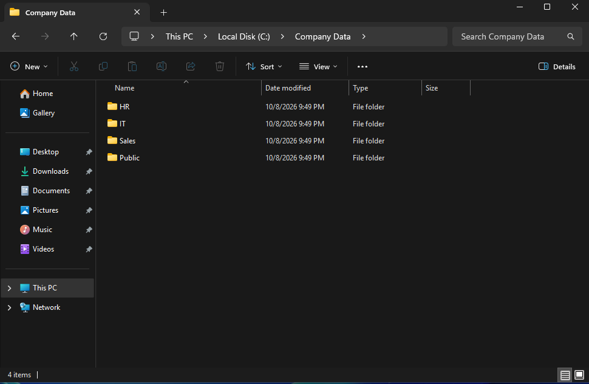
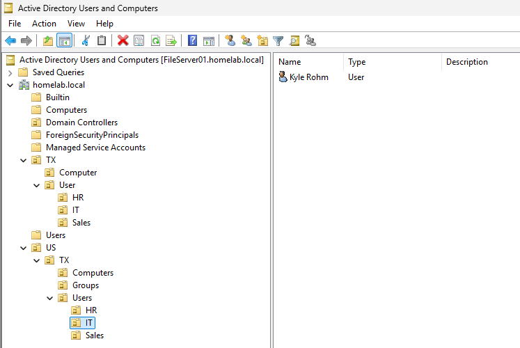

[← Back to Main README](../README.md)

# Windows File Server Configuration

## Overview

This section documents the configuration of Windows Server 2025 as a file server integrated with Active Directory Domain Services (AD DS).

The goal is to create shared folders, configure NTFS and share permissions, and use Active Directory security groups to control access to shared files from the domain-joined Windows 11 client.

## Objectives

- Configure a Windows File Server
- Create shared folders
- Manage NTFS and share permissions
- Create and configure Active Directory security groups
- Control access to files through Active Directory integration
- Test shared folder access from the Windows 11 client

## Prerequisites

- Windows Server 2025 configured as a Domain Controller
- Active Directory Domain Services installed and configured
- DNS configured for the Active Directory domain
- Domain-joined Windows 11 client (`Computer01`)
- Test user accounts and departmental security groups configured in Active Directory
- Administrative access to `FileServer01`

## Lab Environment

| Component | Configuration |
|---|---|
| Hypervisor | VMware Workstation |
| Operating System | Windows Server 2025 |
| Server Name | `FileServer01` |
| Server Role | Domain Controller and File Server |
| Client Operating System | Windows 11 |
| Client Computer Name | `Computer01` |
| Authentication | Active Directory Domain Services |

---

## Configure File Server Folders

Created a directory structure to organize shared files by department.

### Create the Shared Folder

1. Signed in to `FileServer01`.
2. Opened **File Explorer**.
3. Navigated to the `C:\` drive and created a folder called `Company Data`.
4. Inside `C:\Company Data`, the following folders were created:



---

## OU Restructure

Updated the OU layout to a more intuitive department-based structure.

This restructure separates computers, groups, and users:
```
<homelab.local>
│
└── US
     |
     └── TX 
         |
         ├──── Computers
         |       └── Computer01
         |
         ├──── Groups
         |       ├── HR
         |       ├── IT
         |       └── Sales
         ├──── Users
                |
                ├── HR
                │    └── HRUser
                |           └── Mary Delgado
                │
                ├── IT
                │    └── ITAdmin
                │           └── Kyle Rohm
                |
                └── Sales
                      └── SalesUser
                             └── Aaron McMurtry
```                      



## Create Active Directory Security Groups

Used Active Directory security groups to manage access to the previously created folders.

1. Opened **Server Manager**.
2. Selected **Tools → Active Directory Users and Computers**.
3. Created security groups and added them to the correct OU:

```
Groups
  ├── HR
  ├── IT
  └── Sales
```

5. Add the appropriate domain users to each group.
6. Verify that each user is a member of the correct group.

For example:

* `HRUser` → `HR`
* `SalesUser` → `Sales`
* `ITAdmin` → `IT`

Use the actual usernames and group names configured in the lab.

> **Security Note:** Membership in the `Domain Admins` group should be limited to accounts that require domain-wide administrative privileges. Departmental file access should normally be assigned through dedicated security groups.


---

## Configure NTFS Permissions

NTFS permissions control which users and groups can access files and folders on the file system.

Configure permissions on each departmental folder so that access is granted to the appropriate Active Directory security group.

### Configure HR Folder Permissions

1. Open **File Explorer** on `FileServer01`.
2. Navigate to `C:\Shares`.
3. Right-click the `HR` folder and select **Properties**.
4. Open the **Security** tab.
5. Select **Edit**.
6. Select **Add**.
7. Enter the domain's `HR` security group.
8. Select **Check Names**, then select **OK**.
9. Assign the appropriate permissions to the group.
10. Apply the changes.

For this lab, grant the `HR` group **Modify** permission if HR users need to create, edit, and delete files.

### Configure Sales Folder Permissions

Repeat the process for `C:\Shares\Sales`.

* Add the `Sales` security group.
* Grant **Modify** permission if Sales users need to create, edit, and delete files.
* Apply the changes.

### Configure IT Folder Permissions

Repeat the process for `C:\Shares\IT`.

* Add the `IT` security group.
* Grant the access level required for the lab.
* Apply the changes.

### NTFS Permission Summary

| Folder            | Active Directory Group | Example NTFS Permission |
| ----------------- | ---------------------- | ----------------------- |
| `C:\Shares\HR`    | `HR`                   | Modify                  |
| `C:\Shares\IT`    | `IT`                   | Modify                  |
| `C:\Shares\Sales` | `Sales`                | Modify                  |

> **Important:** Review the existing permissions before removing any entries. Preserve the permissions required for Windows administration and system operation. Avoid granting `Everyone` or `Domain Users` broad access to departmental data.


---

## Configure SMB Share Permissions

Share permissions control access when users connect to a folder over the network using SMB.

### Share the HR Folder

1. Right-click `C:\Shares\HR`.
2. Select **Properties**.
3. Open the **Sharing** tab.
4. Select **Advanced Sharing**.
5. Select **Share this folder**.
6. Set the share name to `HR`.
7. Select **Permissions**.
8. Configure the share permissions for the intended users or security groups.
9. Apply the changes.

Repeat these steps for the `IT` and `Sales` folders, using the corresponding share names.

### Share Permission Summary

For this lab, use a consistent approach:

| Share   | Intended Group | Example Share Permission |
| ------- | -------------- | ------------------------ |
| `HR`    | `HR`           | Change and Read          |
| `IT`    | `IT`           | Change and Read          |
| `Sales` | `Sales`        | Change and Read          |

Use the **Change** permission when users need to create, modify, or delete shared files.

> **Important:** Effective access over SMB is determined by the combination of share permissions and NTFS permissions. The more restrictive applicable permission limits the user's effective access.


---

## Verify Shared Folder Configuration

Verify that each departmental folder is shared successfully.

1. Open **Server Manager**.
2. Select **File and Storage Services → Shares**.
3. Confirm that the `HR`, `IT`, and `Sales` shares appear in the list.

Alternatively, open PowerShell on `FileServer01` and run:

```powershell
Get-SmbShare
```

To view the share permissions for a specific share, run:

```powershell
Get-SmbShareAccess -Name "HR"
Get-SmbShareAccess -Name "IT"
Get-SmbShareAccess -Name "Sales"
```

Confirm that the share permissions match the intended configuration.


---

## Access Shared Folders from Computer01

Test the shared folders from the domain-joined Windows 11 client.

1. Sign in to `Computer01` using a domain user account.
2. Open **File Explorer**.
3. Select the address bar.
4. Enter the network path to the desired share.

Example:

```text
\\FileServer01\HR
```

Other available shares:

```text
\\FileServer01\IT
\\FileServer01\Sales
```

If name resolution fails, verify that `Computer01` is using the correct Active Directory DNS server and that `FileServer01` can be reached over the network.


---

## Test Active Directory Access Control

Verify that the configured permissions allow authorized users to access their departmental folders and restrict access to other departments.

### Test HR User Access

1. Sign in to `Computer01` as the HR test user.
2. Open `\\FileServer01\HR`.
3. Confirm that the user can access the folder.
4. Create a test text file if Modify permission is assigned.
5. Attempt to open `\\FileServer01\Sales`.
6. Confirm that access is denied if the user is not authorized for the Sales share.

### Test Sales User Access

1. Sign in to `Computer01` as the Sales test user.
2. Open `\\FileServer01\Sales`.
3. Confirm that the user can access the folder.
4. Create a test text file if Modify permission is assigned.
5. Attempt to open `\\FileServer01\HR`.
6. Confirm that access is denied if the user is not authorized for the HR share.

### Test IT User Access

1. Sign in using the designated IT test account.
2. Open `\\FileServer01\IT`.
3. Confirm that the user can access the folder according to the configured permissions.

Record the results of each test.

| Test                            | Expected Result                 | Status  |
| ------------------------------- | ------------------------------- | ------- |
| HR user accesses HR share       | Access allowed                  | Pending |
| HR user accesses Sales share    | Access denied if not authorized | Pending |
| Sales user accesses Sales share | Access allowed                  | Pending |
| Sales user accesses HR share    | Access denied if not authorized | Pending |
| IT user accesses IT share       | Access allowed                  | Pending |

Update the status column after completing the tests.

> **Note:** These access-denied tests are valid only if the user has no other applicable permissions through group membership, inherited NTFS entries, or share permissions. Verify effective access rather than assuming that membership in one department automatically prevents access to another.


---

## Troubleshooting File Sharing

Use the following checks if a client cannot access a shared folder.

### Verify Network Connectivity

From `Computer01`, run:

```powershell
ping <FILESERVER01-IP-ADDRESS>
```

### Verify DNS Resolution

Run:

```powershell
nslookup FileServer01
```

Confirm that the server name resolves to the correct IP address.

### Verify SMB Shares

On `FileServer01`, run:

```powershell
Get-SmbShare
```

### Verify Share Permissions

Run:

```powershell
Get-SmbShareAccess -Name "HR"
```

Replace `HR` with the appropriate share name when checking the other shares.

### Verify NTFS Permissions

1. Open the folder's **Properties**.
2. Select the **Security** tab.
3. Review the configured users and groups.
4. Check for inherited permissions that may grant or deny access.
5. Confirm that the intended Active Directory group has the required permissions.

### Verify User Group Membership

Run the following command on a system with the Active Directory PowerShell module:

```powershell
Get-ADGroupMember -Identity "HR"
```

Replace `HR` with the appropriate group name as needed.

If a user's group membership was recently changed, sign out and sign back in to refresh the user's logon token before testing again.

---

## Final File Server Configuration

After completing the configuration, the lab should include:

* A Windows Server 2025 file server integrated with Active Directory
* Departmental shared folders for HR, IT, and Sales
* SMB shares configured for network access
* NTFS permissions configured on each departmental folder
* Active Directory security groups used to assign access
* A domain-joined Windows 11 client accessing shared folders
* Successful tests confirming that authorized users can access their assigned shares
* Access-denied tests confirming that unauthorized users cannot access restricted shares

## Skills Demonstrated

* Windows Server file server configuration
* SMB file sharing
* NTFS permissions management
* Share permissions management
* Active Directory security group management
* Access control and least privilege
* Windows client-to-server connectivity
* File share access testing
* DNS and network troubleshooting
* PowerShell administration

```
```
