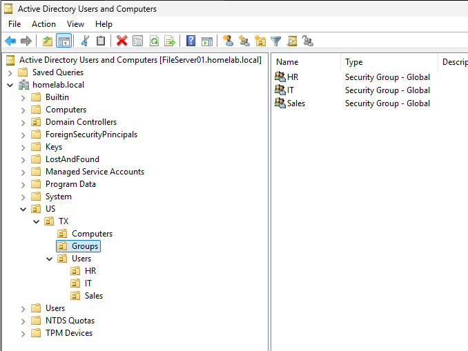
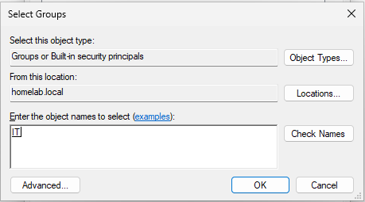
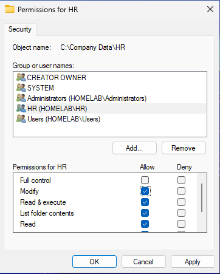
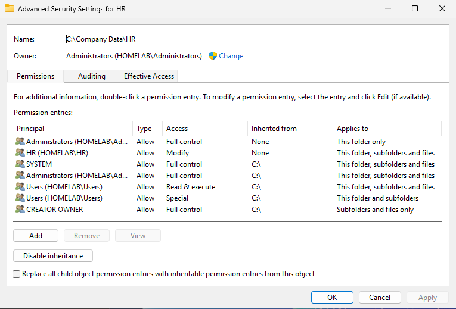
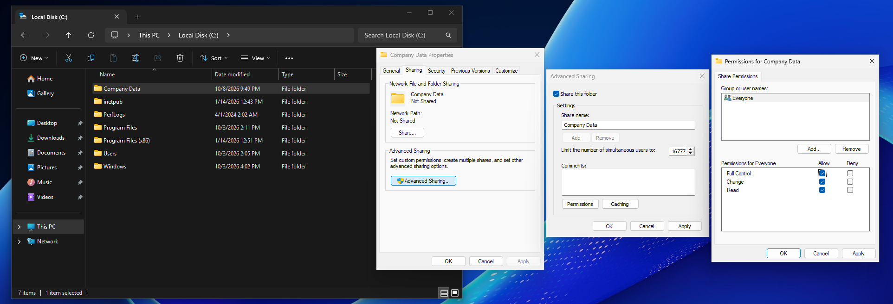
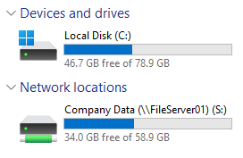
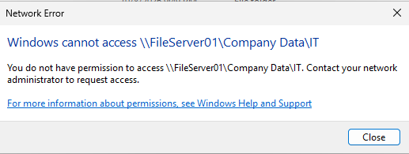

[← Back to Main README](../README.md)

# Windows File Server Configuration

## Overview

This section documents the configuration of Windows Server 2025 as a file server integrated with Active Directory Domain Services (AD DS).

The goal is to create shared folders, configure NTFS and share permissions, and use Active Directory security groups to control access to shared files from the domain-joined Windows 11 client.

## Objectives

- Configure a Windows File Server
- Create shared folders
- Manage NTFS and share permissions
- Create and configure Active Directory security groups
- Control access to files through Active Directory integration
- Test shared folder access from the Windows 11 client

## Prerequisites

- Windows Server 2025 configured as a Domain Controller
- Active Directory Domain Services installed and configured
- DNS configured for the Active Directory domain
- Domain-joined Windows 11 client (`Computer01`)
- Test user accounts and departmental security groups configured in Active Directory
- Administrative access to `FileServer01`

## Lab Environment

| Component | Configuration |
|---|---|
| Hypervisor | VMware Workstation |
| Operating System | Windows Server 2025 |
| Server Name | `FileServer01` |
| Server Role | Domain Controller and File Server |
| Client Operating System | Windows 11 |
| Client Computer Name | `Computer01` |
| Authentication | Active Directory Domain Services |

---

## Configure File Server Folders

Created a directory structure to organize shared files by department.

### Created the Shared Folders

1. Signed in to `FileServer01`.
2. Opened **File Explorer**.
3. Navigated to the `C:\` drive and created a folder called `Company Data`.
4. Inside `C:\Company Data`, the following folders were created:


---

## OU Restructure

Updated the OU layout to a more intuitive department-based structure.

This restructure separates computers, groups, and users:
```
<homelab.local>
│
└── US
     |
     └── TX 
         |
         ├──── Computers
         |       └── Computer01
         |
         ├──── Groups
         |       ├── HR
         |       ├── IT
         |       └── Sales
         ├──── Users
                |
                ├── HR
                │    └── HRUser
                |           └── Mary Delgado
                │
                ├── IT
                │    └── ITAdmin
                │           └── Kyle Rohm
                |
                └── Sales
                      └── SalesUser
                             └── Aaron McMurtry
```                      


---

## Create Active Directory Security Groups

Used Active Directory security groups to manage access to the previously created folders.

1. Opened **Server Manager**.
2. Selected **Tools → Active Directory Users and Computers**.
3. Created security groups and added them to the correct OU:

```
Groups
  ├── HR
  ├── IT
  └── Sales
```



---

## Assign Security Groups

Added each domain user to the corresponding security group:

1. Right-clicked `Kyle Rohm` in the IT folder.
2. Clicked `Properties`.
3. Selected the `Member Of` tab and clicked `Add`.
4. Typed `IT` in the text field → Check Names → **OK** → **Apply**



5. Repeated this process for the remaining users as represented below:

* `Mary Delgado` → Added `HR` group
* `Aaron McMurtry` → Added `Sales` group

---

## Configure NTFS Permissions

Configured permissions on each departmental folder so that access is granted to the appropriate Active Directory security group.

### Configured Company Data Folder Permissions

1. Opened **File Explorer** on `FileServer01`.
2. Navigated to `C:\Company Data`.
3. Right-clicked the `HR` folder and selected **Properties**.
4. Opened the **Security** tab.
5. Selected **Edit** → **Add**
6. Entered the domain's `HR` security group.
7. Selected **Check Names**, then **OK**.
8. Assigned **Modify** access level and then applied changes.



> Repeated the process for the IT, Sales, and Public folders.

### NTFS Permission Summary

| Folder            | Active Directory Group | NTFS Permission         |
| ----------------- | ---------------------- | ----------------------- |
| `C:\Shares\HR`    | `HR`                   | Modify                  |
| `C:\Shares\IT`    | `IT`                   | Modify                  |
| `C:\Shares\Sales` | `Sales`                | Modify                  |

---

## Disable Folder Inheritance

Disabled inheritance so that users cannot gain access to unauthorized folders.

Only the `Public` folder can be used by all three users.

1. Right-clicked the `HR` folder and went to **Properties**.
2. Navigated to the **Security** tab and clicked **Advanced**.
3. Selected `Disable inheritance` → **Convert inherited permissions into explicit permissions on this object**.
4. Selected both user entries and removed them.



> This process was repeated for the `IT` and `Sales` folders. The `Public` folder was assigned **Domain users** as read only access and **IT** as modify access level.

---

## Configure Share Permissions

Full control share permissions were given to all users for the Company Data folder.

1. Right-clicked `C:\Company Data`.
2. Selected **Properties**.
3. Opened the **Sharing** tab.
4. Selected **Advanced Sharing**.
5. Selected **Share this folder**.
6. Selected **Permissions**.
7. Selected **Everyone** and clicked **Allow | Full Control**.
8. Applied the changes.



---

## Map Shared Drive

Mapped each user's access to the `Company Data` folder

1. Signed in to `Computer01` as *Mary Delgado*.
2. Opened **File Explorer**.
3. Clicked **This PC** → `…` → **Map network drive**
4. Selected the `S:` drive and entered `\\FileServer01\Company Data` as the UNC path → **Finish**



> This process was repeated for Kyle and Aaron's accounts.

---

## Verify Shared Folder Configuration

Tested the shared folders from the domain-joined Windows 11 client.

* Attempted to open the `IT` folder as *Mary Delgado* (HR user):



> This process was repeated for Kyle and Aaron's accounts, verifying that unauthorized access was blocked.

---
